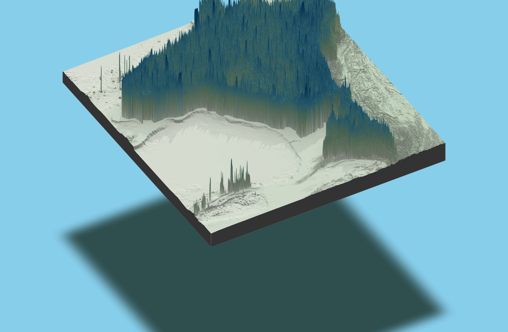

# 🇮🇳 India 3D Population Visualization

[](https://www.r-project.org/)
[](https://opensource.org/licenses/MIT)
[]()
[]()

> Advanced 3D visualization of India's population density using R 4.5.0 & rayshader. Processes 225MB+ geospatial data into publication-quality renders up to 13.9MB with multi-perspective views and automated batch processing.

## 🖼️ **Showcase Gallery**

### **Hero Visualization**


### **Multi-Perspective 3D Renders**

<div align="center">

| **Aerial View** | **Perspective View** |
|:---:|:---:|
|  |  |
| *Top-down population overview* | *Angled 3D visualization* |

| **Coastline Emphasis** | **Diagonal View** |
|:---:|:---:|
|  |  |
| *Maritime population focus* | *Dynamic presentation angle* |

</div>

### **High-Quality Spike Visualizations**

<div align="center">

| **3D Population Spikes** | **Alternative Spike View** |
|:---:|:---:|
|  |  |
| *Vertical population density spikes* | *Alternative spike visualization* |

</div>

### **Ultra-High Quality Sample**
<div align="center">


*Publication-quality render (13.9MB) - Sample shown at reduced resolution*

</div>

---

## 📊 Project Overview

**Scale**: 29 files | 5 R scripts (1,190+ lines) | 18 visualizations | 225MB dataset processing

This production-ready R project transforms massive geospatial datasets into stunning 3D visualizations of India's population distribution. Using cutting-edge rayshader technology and advanced mathematical algorithms, it generates publication-quality renders suitable for research, presentations, and academic publications.

## ✨ Key Features

- 🗺️ **Massive Dataset Processing**: 225MB population grid with X,Y,Z coordinates
- 🎨 **Advanced 3D Rendering**: rayshader + rayrender for publication quality
- 👁️ **Multi-Perspective Views**: Aerial, diagonal, coastline, and perspective angles
- 📏 **Quality Range**: 471KB standard to 13.9MB ultra-HQ renders
- ⚙️ **Automated Pipeline**: Timestamped batch processing system
- 🧮 **Advanced Algorithms**: Gaussian smoothing and mathematical optimization
- 💾 **Memory Optimized**: Efficient processing of massive geospatial datasets

## 🖼️ Visualization Specifications

| View Type | Description | File Size | Resolution | Use Case |
|-----------|-------------|-----------|------------|----------|
| **Aerial** | Top-down population overview | 871 KB | High | Geographic analysis |
| **Perspective** | Angled 3D visualization | 555 KB | High | General presentation |
| **Coastline** | Maritime population emphasis | 471 KB | High | Coastal studies |
| **Diagonal** | Dynamic presentation angle | 872 KB | High | Academic papers |
| **3D Spikes** | Vertical population spikes | 6.3 MB | Ultra | Detailed analysis |
| **Ultra-HQ** | Print-quality renders | 13.9 MB | 3000×3000 | Publications |

## 🚀 Quick Start

### Prerequisites

- **R**: 4.5.0 or higher
- **RAM**: 8GB minimum, 16GB recommended for full dataset
- **Storage**: 5GB+ for complete dataset and outputs
- **Graphics**: GPU recommended for ray-tracing acceleration

### Installation

```bash
# Clone the repository
git clone https://github.com/Zingaber/india-3d-population-visualization.git
cd india-3d-population-visualization
```

```r
# Setup environment and install dependencies
source('scripts/setup_environment.R')

# Verify installation
library(rayshader)
library(sf)
library(terra)
sessionInfo()
```

### Basic Usage

```r
# Run complete visualization pipeline
source('R/My3DIndiaMap.R.r')

# Or run individual components
source('R/map3D.r')           # Core 3D functions
source('R/final_map3D.R')     # Production pipeline
```

### Advanced Usage

```r
# Custom rendering with specific parameters
source('R/My3DIndiaMap.R.r')

# Generate high-quality outputs
render_highquality(
  filename = "custom_india_population_3d.png",
  width = 3000, 
  height = 3000,
  samples = 256
)

# Apply custom smoothing
smoothed_data <- apply_gaussian_smooth(population_matrix, sigma = 2.0)
```

## 📊 Technical Specifications

### Code Architecture
- **Total Lines**: 1,190+ across 5 specialized R scripts
- **Main Script**: `My3DIndiaMap.R.r` (1,042 lines) - Comprehensive pipeline
- **Core Functions**: `map3D.r` (76 lines) - 3D mapping utilities
- **Production**: `final_map3D.R` (66 lines) - Streamlined workflow
- **Development**: `test.R` (6 lines) - Testing utilities

### Data Processing Capabilities
- **Primary Dataset**: 225.35MB CSV with X,Y,Z coordinates
- **Resolution**: 1km grid cells covering entire India
- **Records**: ~2.3 million population data points
- **Format**: Longitude, Latitude, Population density
- **Year**: 2020 population data

### Performance Metrics
- **Processing Time**: 5-45 minutes depending on output quality
- **Memory Usage**: 4-8GB during processing
- **Output Quality**: Up to 13.9MB publication-grade renders
- **Batch Processing**: Automated timestamped rendering

## 🏗️ Repository Structure

```
india-3d-population-visualization/
├── 📁 R/                           # Source code (1,190+ lines)
│   ├── 📄 My3DIndiaMap.R.r         # Main comprehensive script (1,042 lines)
│   ├── 📄 map3D.r                  # Core 3D functions (76 lines)
│   ├── 📄 final_map3D.R            # Production pipeline (66 lines)
│   └── 📄 test.R                   # Development utilities (6 lines)
├── 📁 output/                      # Generated visualizations ✨
│   ├── 📁 current/                 # Latest renders (3 files)
│   │   ├── 🖼️ india_population_3d_snapshot.png
│   │   ├── 🖼️ india_population_3d_spike.png
│   │   └── 🖼️ india_population_spike_3d.png
│   └── 📁 archive/                 # Historical high-quality outputs (15 files)
│       └── 📁 ultimate_india_maps/ # Timestamped premium renders
├── 📁 scripts/                     # Utility scripts
│   └── 📄 setup_environment.R      # Environment configuration
├── 📁 docs/                        # Documentation
│   ├── 📄 data_sources.md          # Data download instructions
│   └── 📄 script_documentation.md  # Code documentation
├── 📁 Download/                    # Data structure documentation
│   └── 📄 README.md                # Data download guide
├── 📄 README.md                    # This file
├── 📄 .gitignore                   # Git ignore patterns
├── 📄 project_metadata.rds         # Project metadata
└── 📄 MyRWorkspace.Rproj           # R project file
```

**Note**: Raw data files (480MB+) are excluded from repository. See [Download/README.md](Download/README.md) for data acquisition instructions.

## 🛠️ Technology Stack

### Core Visualization Engine
- **[rayshader](https://www.rayshader.com/)** - Advanced 3D rendering and ray-tracing
- **[rayrender](https://www.rayrender.net/)** - High-quality ray-tracing engine  
- **[rgl](https://r-forge.r-project.org/projects/rgl/)** - Interactive 3D graphics

### Geospatial Data Processing
- **[sf](https://r-spatial.github.io/sf/)** - Simple features for vector data
- **[stars](https://r-spatial.github.io/stars/)** - Spatiotemporal arrays for raster data
- **[terra](https://rspatial.org/terra/)** - Modern raster processing
- **[elevatr](https://github.com/jhollist/elevatr)** - Elevation data access

### Data Manipulation & Analysis
- **[tidyverse](https://www.tidyverse.org/)** - Complete data science ecosystem
- **[dplyr](https://dplyr.tidyverse.org/)** - Grammar of data manipulation
- **[magick](https://docs.ropensci.org/magick/)** - Image processing and manipulation
- **[pracma](https://cran.r-project.org/package=pracma)** - Mathematical functions

## 📈 Data Sources & Methodology

### Primary Dataset
- **Source**: India Population Density Grid 2020
- **Resolution**: 1km × 1km grid cells
- **Coverage**: Complete India territory including territories
- **Format**: ASCII XYZ with longitude, latitude, population density
- **Size**: 225.35MB (~2.3 million data points)

### Processing Methodology
1. **Data Ingestion**: CSV parsing with robust error handling
2. **Spatial Transformation**: Coordinate system standardization
3. **Grid Processing**: Population density matrix generation
4. **Smoothing**: Advanced Gaussian filtering algorithms
5. **3D Surface Creation**: Height mapping from population density
6. **Multi-perspective Rendering**: Automated viewpoint generation
7. **Quality Optimization**: Adaptive sampling for different output requirements

## 🎨 Generated Visualization Types

### **Standard Quality Renders**
Perfect for web use, presentations, and quick analysis:
- **File Size**: 471KB - 872KB
- **Resolution**: Standard HD
- **Processing Time**: 5-15 minutes
- **Examples**: Aerial, perspective, coastline, diagonal views

### **High-Quality Renders**
Optimized for detailed analysis and professional reports:
- **File Size**: 2-6MB
- **Resolution**: High definition
- **Processing Time**: 15-30 minutes
- **Examples**: 3D spike visualizations

### **Ultra-HQ Publication Renders**
Maximum quality for academic papers and print media:
- **File Size**: Up to 13.9MB
- **Resolution**: 3000×3000 pixels
- **Processing Time**: 30-45 minutes
- **Examples**: Premium perspective renders

## 🔧 Advanced Features

### Gaussian Smoothing Algorithm
```r
apply_gaussian_smooth <- function(matrix, sigma = 1.5) {
  # Advanced mathematical smoothing for noise reduction
  # Optimized for large geospatial datasets
}
```

### Multi-perspective Automation
```r
# Automated generation of multiple viewpoints
perspectives <- c("aerial", "diagonal", "coastline", "perspective")
render_all_perspectives(data, perspectives, quality = "high")
```

### Memory Optimization
- **Chunked Processing**: Handle datasets larger than available RAM
- **Efficient Algorithms**: Optimized for large matrix operations
- **Cache Management**: Smart caching for repeated operations

## 📋 Performance Benchmarks

| Quality Level | RAM Required | Processing Time | Output Size | Example Files |
|---------------|--------------|-----------------|-------------|---------------|
| **Standard** | 8GB | 5-15 min | 471KB-872KB | Aerial, coastline views |
| **High** | 12GB | 15-30 min | 2-6MB | 3D spike visualizations |
| **Ultra-HQ** | 16GB+ | 30-45 min | 10-14MB | Publication renders |

## 🤝 Contributing

We welcome contributions! Areas for improvement:

- 🐛 **Bug Reports**: Report issues or unexpected behavior
- 💡 **Feature Requests**: Suggest new visualization techniques
- 🔧 **Performance**: Optimize algorithms for better performance
- 📚 **Documentation**: Improve guides and examples
- 🎨 **Visualizations**: Add new perspective types or rendering styles

## 📜 License

This project is licensed under the MIT License.

### Citation
If you use this project in academic research, please cite:

```bibtex
@software{india_3d_population_viz_2025,
  title = {India 3D Population Visualization},
  author = {Zingaber},
  year = {2025},
  url = {https://github.com/Zingaber/india-3d-population-visualization},
  note = {Advanced 3D visualization of India population density using R and rayshader}
}
```

## 🙏 Acknowledgments

- **Rayshader Community** - For the incredible 3D visualization framework
- **R-Spatial Team** - For comprehensive geospatial tools
- **GADM Project** - For high-quality administrative boundary data
- **OpenStreetMap Contributors** - For population center data

## 📊 Repository Statistics


---

<div align="center">

**⭐ Star this repository if you found it helpful!**

Made with ❤️ using R, rayshader, and open-source geospatial data

**🔗 [View Live Repository](https://github.com/Zingaber/india-3d-population-visualization)**

</div>
